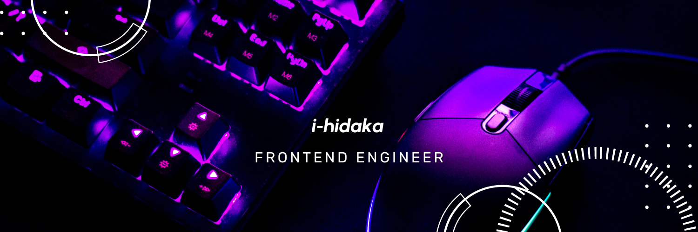

<h3>&nbsp;My Favorite Languages</h3>
<table>
  <tr align="center">
    <td>
      
      <b>TypeScript</b>
    </td>
    <td>
      
      <b>JavaScript</b>
    </td>
    <td>
      
      <b>Vue.js</b>
    </td>
    <td>
      
      <b>React</b>
    </td>
    <td>
      
      <b>Nuxt.js</b>
    </td>
    <td>
      
      <b>Next.js</b>
    </td>
    <td>
      
      <b>Node.js</b>
    </td>
    <td>
      
      <b>Express.js</b>
    </td>
  </tr>
</table>

  
  

